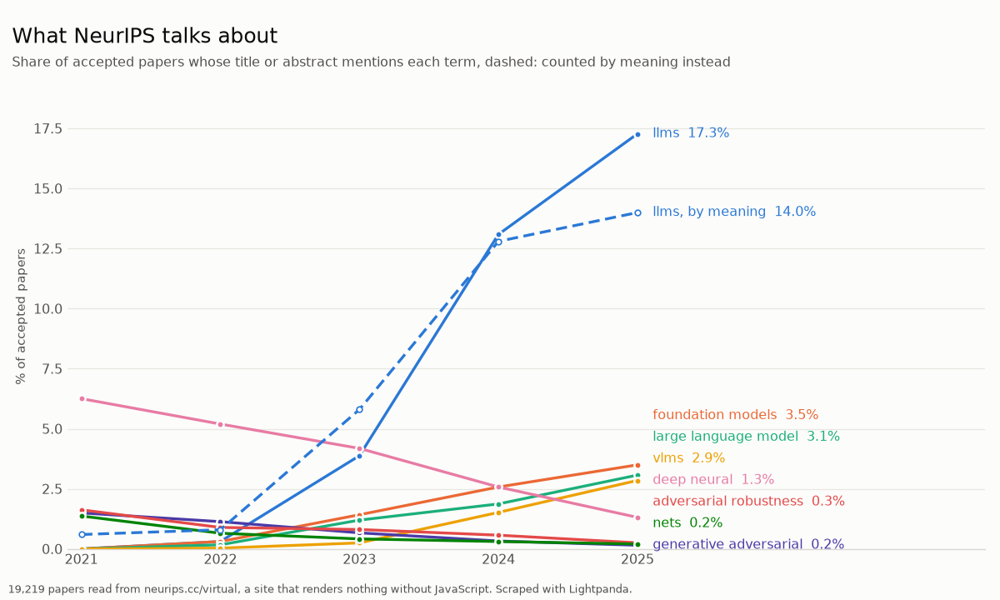

# Examples

The scripts declare their dependencies inline (PEP 723), so they run from
anywhere with [uv](https://docs.astral.sh/uv/) and nothing pre-installed:

```bash
uv run examples/quotes_analysis.py
uv run examples/compare.py --repeat 5
uv run examples/neurips_trends.py
```

Set `LIGHTPANDA_BIN=/path/to/lightpanda` to run against a local browser build
instead of the binary bundled in the wheel.

## `quotes_analysis.py` — scrape a JavaScript-rendered site, analyse with pandas

[quotes.toscrape.com/js](https://quotes.toscrape.com/js/) renders every quote
client-side with jQuery. `requests` gets the page shell — **0 quotes**.
Lightpanda runs the JavaScript and `extract` returns structured records
(quote, author, nested tag list) straight from the rendered DOM — **100
quotes**, no BeautifulSoup in between:

```python
SCHEMA = {
    "quotes": [{"selector": ".quote",
                "fields": {"text": ".text", "author": ".author", "tags": [".tag"]}}],
    "next": {"selector": "li.next a", "attr": "href"},
}

with Browser() as browser, browser.new_session() as page:
    url = "https://quotes.toscrape.com/js/"
    while url:
        page.goto(url=url)
        data = page.extract(schema=SCHEMA)
        rows.extend(data["quotes"])
        url = data["next"]

df = pd.DataFrame(rows)
df.explode("tags")["tags"].value_counts()   # love, inspirational, life, ...
```

The script prints the top tags, most-quoted authors and quote-length stats,
and writes `quotes.png` (matplotlib).

## `compare.py` — the same job with requests, Selenium and Lightpanda

Loads the ten pages of the site with each tool and measures how many quotes it
saw, wall time including browser startup, and peak resident memory summed over
the child processes it spawned. `--repeat N` interleaves the legs N times and
reports medians with the min–max range. Selenium needs Chrome installed
(Selenium Manager fetches a matching chromedriver on the first run); that leg
is skipped if Chrome is missing.

Median of 5 runs on a Linux laptop (Core Ultra 7 258V, performance CPU profile):

| tool       | quotes | seconds (min–max)   | peak memory |
|------------|-------:|--------------------:|------------:|
| requests   |      0 |    1.6  (1.5–1.7)   |        0 MB |
| selenium   |    100 |    6.1  (5.8–6.7)   |     1245 MB |
| lightpanda |    100 |    3.4  (3.0–3.6)   |       35 MB |

`requests` is the fastest way to get nothing. Selenium gets the data but
drags a full Chrome (plus a chromedriver download and version matching) along
for the ride; Lightpanda gets the same data from a single `pip install`, in
about half the time and ~35× less memory. The script writes `compare.png`.

## `neurips_trends.py` — five years of an ML conference, from a site with no HTML

[neurips.cc/virtual/2025/papers.html](https://neurips.cc/virtual/2025/papers.html)
lists every accepted paper, and `requests` gets none of them: 800 KB of scripts
wrapped around an empty card list and a `<noscript>` reading *"Enable Javascript
in your browser to see the papers page"*.

```python
soup = BeautifulSoup(requests.get("https://neurips.cc/virtual/2025/papers.html").text)
len(soup.select(".myCard"))   # 0
```

Rendering it is not enough either. The page fetches a 27 MB index, keeps all
5858 papers in a JavaScript array, and only ever builds 400 cards from it — so a
scraper that reads the DOM still sees a seventh of the conference. Lightpanda
reads the array:

```python
async with AsyncBrowser(args=["--http-timeout", "180000"]) as browser:   # the index is 27 MB
    async with browser.session() as page:
        await page.goto(url=f"https://neurips.cc/virtual/{year}/papers.html")
        await page.wait_for_script(script="typeof allPapers !== 'undefined' && allPapers.length > 0")
        rows = await page.evaluate(script="return allPapers.map(p => [p.title, p.abstract, p.url])")
```

One browser process per year, five years at once, about 100 seconds for **19,219
papers with abstracts**. (Several sessions inside one process contend badly on
this workload and most of them fail; separate processes are both reliable and
faster.)

Nothing then tells it what to look for. It counts every 1-to-3 word phrase in
the corpus and ranks them by how much their share grew or shrank, which takes a
couple of seconds:

```
year                    2021  2022  2023  2024  2025
llms                     0.0   0.3   3.9  13.1  17.3
foundation models        0.0   0.3   1.4   2.6   3.5
large language model     0.0   0.2   1.2   1.9   3.1
vlms                     0.0   0.0   0.3   1.5   2.9
generative adversarial   1.5   1.1   0.7   0.3   0.2
adversarial robustness   1.6   0.9   0.8   0.6   0.3
deep neural              6.3   5.2   4.2   2.6   1.3
nets                     1.4   0.7   0.4   0.3   0.2
```

Every phrase that grew is about language models in some form. `llms` goes from
0 to 1,012 of 5858 papers; `deep neural` falls from 6.3% and crosses it on the
way down, in 2023.

Two filters get that out of the noise, and both are properties of the corpus
rather than lists of words to disapprove of. Ranking by *ratio* instead of by
absolute change is what excludes writing style, which drifted a long way here —
`introduce` and `framework` each rose about 20 points, `proposed` and `consider`
fell — without being a topic. And a phrase is kept only if it shows up in some
paper's **title**: authors put topics in titles and never put prose there, which
is what separates `3d gaussian splatting` from `advancements`. Measured over the
whole corpus, topic phrases appear in titles about 15% of the time and prose
phrases 0%. The cost is bare model names like `qwen2`, which appear in abstracts
as baselines and almost never in a title.

Asking which phrases *peak* in a single year is sharper still, because a peak is
usually an event:

```
2021: networks deep, algorithms learning, learning learn, nets
2022: sparsely, neural tangent kernel, constants, variational autoencoders
2023: chatgpt, human visual, stable diffusion, diffusion probabilistic
2024: 3d gaussian splatting, 3d gaussians, chat, mamba
2025: r1, grpo, reasoning models, mllms
```

From 2023 on that needs no interpretation. The two oldest years are weak for a
structural reason: they are the edge of the window, so nothing can be shown
rising into them, and what is distinctive about them is mostly what later went
away.



### The hand-picked comparison

`--curated` swaps the discovered terms for six written by hand: large language
models, diffusion models, in-context learning, RLHF & alignment, graph neural
networks, GANs. It makes a prettier chart, covering more subfields and moving in
both directions, and it is worth keeping for exactly one reason — as a warning.

Those six were chosen from what I already expected to have moved, then narrowed
to the ones that moved most. Four that stayed flat (`transformers` 7.3% → 9.4%,
`contrastive learning` 5.2% → 3.9%, `federated learning` 1.9% → 1.2%, `agents &
tool use` 0.0% → 1.8%) were dropped for being boring. That is selecting on the
outcome, and it is why the default no longer does it. The discovered version
makes the stronger claim — *everything* that grew was language models — which
the curated chart hides by construction.

### Counting by meaning instead

`--semantic` asks the same question without the phrase: it embeds a sample of
each year and estimates the share by similarity instead of by string match. It
uses Gemini when `GOOGLE_API_KEY` is set and a local ONNX model otherwise, so it
runs either way.

Nothing is hand-written here either. It chases whichever term grew most — `llms`
— and describes it with the phrases that keep it company in the same papers,
which the corpus supplies: *llms, llm, large language models, capabilities llms,
llm based, reasoning llms, llm generated*.

```
      phrase  semantic (sampled)
2021     0.0                 0.6
2022     0.3                 0.8
2023     3.9                 5.8
2024    13.1                12.8
2025    17.3                14.0
```

The disagreement is the interesting part. The semantic line leads the phrase
line into 2023, and the extra papers are real: *"Think Big, Teach Small: Do
Language Models Distil Occam's Razor?"* (2021) and *"Diffusion-LM Improves
Controllable Text Generation"* (2022) are language model work written before the
field settled on the words we now use for it. A keyword cannot find those. The
cutoff is calibrated once so the overall rate matches the phrase rate, which is
why the later years come out lower to pay for it — the shape of the
redistribution is the result, not the absolute level.

Which embedding does the work matters more than it might seem. Ranking the true
phrase matches to the top, over the same 1,250-paper sample:

| model | AUC | to embed 1,250 papers |
|---|---:|---|
| `gemini-embedding-001` | 0.956 | one API call per 100, needs a key |
| `bge-base-en-v1.5` (ONNX) | 0.923 | 481 s on CPU |
| **`bge-small-en-v1.5` (ONNX)** — what the script uses without a key | **0.909** | **130 s on CPU** |
| `all-MiniLM-L6-v2` (ONNX) | 0.854 | 22 s on CPU |
| `potion-base-32M` (model2vec, static) | 0.844 | 0.4 s |
| `potion-base-8M` (model2vec, static) | 0.790 | 0.5 s |

None of these need a GPU and only the first needs a network. The static models
are effectively free and useless for this: they score every year at about the
same level, flattening the trend into a line that misses it. `all-MiniLM-L6-v2`
is the speed pick if 130 s is too long to wait.

The general lesson is not "use the biggest model". It is that embeddings are
good at *ranking* by meaning and much weaker at deciding whether one document
clears a bar — which is why the headline chart counts phrases and the semantic
pass is framed as a comparison rather than as the answer.
