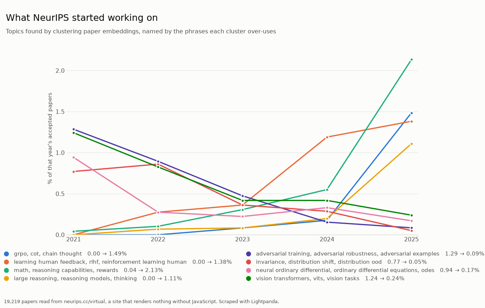

# Examples

The scripts declare their dependencies inline (PEP 723), so they run from
anywhere with [uv](https://docs.astral.sh/uv/) and nothing pre-installed:

```bash
uv run examples/quotes_analysis.py
uv run examples/compare.py --repeat 5
uv run examples/neurips_topics.py
```

Set `LIGHTPANDA_BIN=/path/to/lightpanda` to run against a local browser build
instead of the binary bundled in the wheel.

## `quotes_analysis.py` — scrape a JavaScript-rendered site, analyse with pandas

[quotes.toscrape.com/js](https://quotes.toscrape.com/js/) renders every quote
client-side with jQuery. `requests` gets the page shell — **0 quotes**.
Lightpanda runs the JavaScript and `extract` returns structured records
(quote, author, nested tag list) straight from the rendered DOM — **100
quotes**, no BeautifulSoup in between:

```python
SCHEMA = {
    "quotes": [{"selector": ".quote",
                "fields": {"text": ".text", "author": ".author", "tags": [".tag"]}}],
    "next": {"selector": "li.next a", "attr": "href"},
}

with Browser() as browser, browser.new_session() as page:
    url = "https://quotes.toscrape.com/js/"
    while url:
        page.goto(url=url)
        data = page.extract(schema=SCHEMA)
        rows.extend(data["quotes"])
        url = data["next"]

df = pd.DataFrame(rows)
df.explode("tags")["tags"].value_counts()   # love, inspirational, life, ...
```

The script prints the top tags, most-quoted authors and quote-length stats,
and writes `quotes.png` (matplotlib).

## `compare.py` — the same job with requests, Selenium and Lightpanda

Loads the ten pages of the site with each tool and measures how many quotes it
saw, wall time including browser startup, and peak resident memory summed over
the child processes it spawned. `--repeat N` interleaves the legs N times and
reports medians with the min–max range. Selenium needs Chrome installed
(Selenium Manager fetches a matching chromedriver on the first run); that leg
is skipped if Chrome is missing.

Median of 5 runs on a Linux laptop (Core Ultra 7 258V, performance CPU profile):

| tool       | quotes | seconds (min–max)   | peak memory |
|------------|-------:|--------------------:|------------:|
| requests   |      0 |    1.6  (1.5–1.7)   |        0 MB |
| selenium   |    100 |    6.1  (5.8–6.7)   |     1245 MB |
| lightpanda |    100 |    3.4  (3.0–3.6)   |       35 MB |

`requests` is the fastest way to get nothing. Selenium gets the data but
drags a full Chrome (plus a chromedriver download and version matching) along
for the ride; Lightpanda gets the same data from a single `pip install`, in
about half the time and ~35× less memory. The script writes `compare.png`.

## `neurips_topics.py` — find what a field started working on, with nothing told to it

[neurips.cc/virtual/2025/papers.html](https://neurips.cc/virtual/2025/papers.html)
lists every accepted paper and `requests` gets none of them: 800 KB of scripts
around an empty card list and a `<noscript>` reading *"Enable Javascript in your
browser to see the papers page"*.

```python
soup = BeautifulSoup(requests.get("https://neurips.cc/virtual/2025/papers.html").text)
len(soup.select(".myCard"))   # 0
```

Rendering it is not enough either. The page fetches a 27 MB index, keeps all
5858 papers in a JavaScript array, and only ever builds 400 cards from it, so a
scraper that reads the DOM still sees a seventh of the conference. Lightpanda
reads the array:

```python
async with AsyncBrowser(args=["--http-timeout", "180000"]) as browser:   # the index is 27 MB
    async with browser.session() as page:
        await page.goto(url=f"https://neurips.cc/virtual/{year}/papers.html")
        await page.wait_for_script(script="typeof allPapers !== 'undefined' && allPapers.length > 0")
        rows = await page.evaluate(script="return allPapers.map(p => [p.title, p.abstract, p.url])")
```

One browser process per year, five years at once, about a minute for **19,219
papers with abstracts**. (Several sessions inside one process contend badly on
this workload and most of them fail; separate processes are both reliable and
faster.)

Those get embedded once and clustered by **Chinese Whispers**. Link every pair
of papers alike enough to be worth linking, then let each paper repeatedly adopt
the weighted-majority topic of whatever it is linked to. No number of clusters
is chosen, and a paper linked to nothing stays on its own instead of being
forced somewhere. Each cluster is then named by the phrases its papers use far
more than the rest of the conference does.

Nothing supplies a topic list. This is the whole output:

```
206,780 edges, 2,511 clusters, 66 with 60+ papers, 58% of papers in one

year                                                                 2021  2022  2023  2024  2025
grpo, cot, chain thought                                             0.00  0.00  0.08  0.18  1.49
learning human feedback, rlhf, reinforcement learning human          0.00  0.28  0.36  1.19  1.38
math, reasoning capabilities, rewards                                0.04  0.10  0.31  0.55  2.13
large reasoning, reasoning models, thinking                          0.00  0.07  0.08  0.20  1.11
adversarial training, adversarial robustness, adversarial examples   1.29  0.90  0.47  0.15  0.09
invariance, distribution shift, distribution ood                     0.77  0.86  0.36  0.29  0.05
neural ordinary differential, ordinary differential equations, odes  0.94  0.28  0.22  0.33  0.17
vision transformers, vits, vision tasks                              1.24  0.83  0.42  0.42  0.24
```



Passing a query searches the same embeddings by meaning instead, which costs
nothing extra once they exist:

```
$ uv run examples/neurips_topics.py "making language models reason step by step"

  0.87  2022  Chain-of-Thought Prompting Elicits Reasoning in Large Language Models
  0.86  2023  Why think step by step? Reasoning emerges from the locality of experience
  0.85  2022  Large Language Models are Zero-Shot Reasoners
```

Nothing told it the phrase "chain of thought". It also marks any hit that shares
no word at all with the query, which is where the difference from `grep` shows:
asking for *"teaching machines to see the world in three dimensions"* returns
*"Multistable Shape from Shading Emerges from Patch Diffusion"*, with not one
word in common.

### Why clustering and not counting

Four other ways of turning embeddings into a number were tried on these same
19,219 papers, and all of them fail:

| approach | result |
|---|---|
| mean similarity to a topic, per year | GANs move 0.002 over five years while their share collapses 7× |
| forced nearest-topic assignment | claims two thirds of NeurIPS 2021 was adversarial robustness |
| cutoff fitted to phrase labels | admits 6.6× too many papers; every trend flattens |
| year-to-year corpus similarity | 2025 looks *more* like the past than 2022 did, a corpus-size artifact |

They share a cause. Cosine similarities here sit in a narrow band, roughly 0.65
to 0.90, so anything that compares a paper against a *global* bar drowns in the
19,000 papers that are not about the topic. Chinese Whispers never asks that
question. It only asks which papers are near each other, and relative
neighbourhood structure survives the compression intact.

One parameter remains, `--threshold`, and it decides how alike two papers must
be to be linked at all. It is worth seeing what it does, because the useful
range is narrow:

| threshold | edges | clusters | largest | 60+ | covered |
|---|---|---|---|---|---|
| 0.850 | 905,099 | 289 | 18.7% | 31 | 94% |
| 0.860 | 520,105 | 671 | 16.8% | 52 | 88% |
| 0.870 | 284,891 | 1496 | 10.6% | 56 | 73% |
| **0.875** | **206,780** | **2149** | **5.4%** | **61** | **65%** |
| 0.880 | 147,231 | 3041 | 6.9% | 58 | 55% |

Too low and the graph percolates: at 0.850 a single blob swallows a fifth of the
conference. Too high and it falls apart into fragments nobody is linked to.
0.875 is where the largest cluster is smallest while most papers still have
company.

The clusters are reproducible in character rather than identical. Rerun against
different embeddings and reasoning, RLHF and adversarial robustness reliably
appear, while the precise split between adjacent clusters moves.

**On dlib**, which has a well-known Chinese Whispers implementation: it is not
needed here. Building the graph is numpy work either way and takes 2.5 s; the
propagation itself is 0.88 s in plain Python against 0.38 s in dlib's C++. Half
a second does not pay for a source build needing CMake and a C++ toolchain, and
writing the loop out means the example can show the algorithm rather than hide
it behind a call. (dlib's own all-in-one `chinese_whispers_clustering`, which
builds edges itself, is far slower still — about 80× — because it does the
pairwise comparison in Python objects rather than in numpy.)

### Which model

Ranking the papers that genuinely match a phrase to the top, over a
1,250-paper sample:

| model | AUC | to embed 1,250 papers |
|---|---:|---|
| `gemini-embedding-2` | 0.958 | one API call per 100, needs a key |
| `bge-base-en-v1.5` (ONNX) | 0.923 | 481 s on CPU |
| **`bge-small-en-v1.5` (ONNX)** — the keyless default | **0.909** | **130 s on CPU** |
| `all-MiniLM-L6-v2` (ONNX) | 0.854 | 22 s on CPU |
| `potion-base-32M` (model2vec, static) | 0.844 | 0.4 s |
| `potion-base-8M` (model2vec, static) | 0.790 | 0.5 s |

Only the first needs a network and none need a GPU. `gemini-embedding-001`
scores the same as `-2` within noise, but it is the legacy model. With a key the
whole corpus embeds in about twenty seconds; without one it takes considerably
longer, once, and the 27 MB cache under `~/.cache/neurips_topics` makes every
later run instant.
