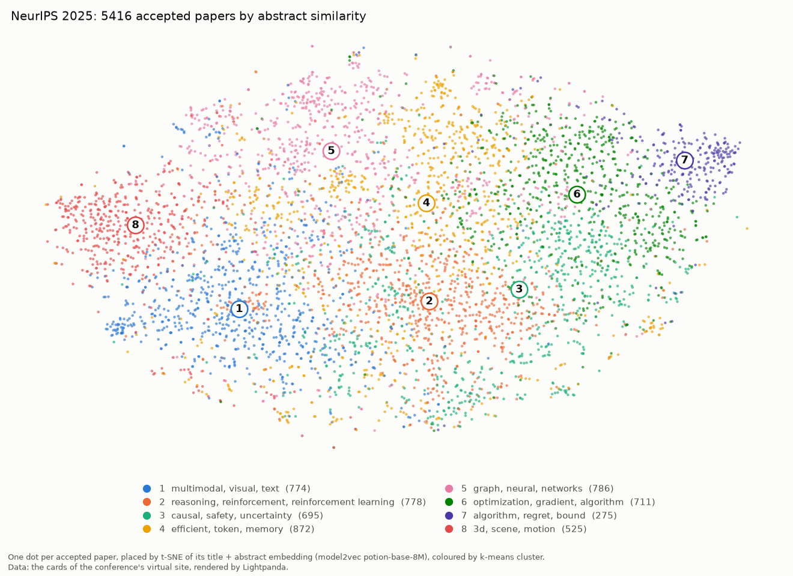

# Examples

The scripts declare their dependencies inline (PEP 723), so they run from
anywhere with [uv](https://docs.astral.sh/uv/) and nothing pre-installed:

```bash
uv run examples/quotes_analysis.py
uv run examples/compare.py --repeat 5
uv run examples/conference_topics.py
```

Set `LIGHTPANDA_BIN=/path/to/lightpanda` to run against a local browser build
instead of the binary bundled in the wheel.

## `quotes_analysis.py` — scrape a JavaScript-rendered site, analyse with pandas

[quotes.toscrape.com/js](https://quotes.toscrape.com/js/) renders every quote
client-side with jQuery. `requests` gets the page shell — **0 quotes**.
Lightpanda runs the JavaScript and `extract` returns structured records
(quote, author, nested tag list) straight from the rendered DOM — **100
quotes**, no BeautifulSoup in between:

```python
SCHEMA = {
    "quotes": [{"selector": ".quote",
                "fields": {"text": ".text", "author": ".author", "tags": [".tag"]}}],
    "next": {"selector": "li.next a", "attr": "href"},
}

with Browser() as browser, browser.new_session() as page:
    url = "https://quotes.toscrape.com/js/"
    while url:
        page.goto(url=url)
        data = page.extract(schema=SCHEMA)
        rows.extend(data["quotes"])
        url = data["next"]

df = pd.DataFrame(rows)
df.explode("tags")["tags"].value_counts()   # love, inspirational, life, ...
```

The script prints the top tags, most-quoted authors and quote-length stats,
and writes `quotes.png` (matplotlib).

## `compare.py` — the same job with requests, Selenium and Lightpanda

Loads the ten pages of the site with each tool and measures how many quotes it
saw, wall time including browser startup, and peak resident memory summed over
the child processes it spawned. `--repeat N` interleaves the legs N times and
reports medians with the min–max range. Selenium needs Chrome installed
(Selenium Manager fetches a matching chromedriver on the first run); that leg
is skipped if Chrome is missing.

Median of 5 runs on a Linux laptop (Core Ultra 7 258V, performance CPU profile):

| tool       | quotes | seconds (min–max)   | peak memory |
|------------|-------:|--------------------:|------------:|
| requests   |      0 |    1.6  (1.5–1.7)   |        0 MB |
| selenium   |    100 |    6.1  (5.8–6.7)   |     1245 MB |
| lightpanda |    100 |    3.4  (3.0–3.6)   |       35 MB |

`requests` is the fastest way to get nothing. Selenium gets the data but
drags a full Chrome (plus a chromedriver download and version matching) along
for the ride; Lightpanda gets the same data from a single `pip install`, in
about half the time and ~35× less memory. The script writes `compare.png`.

## `conference_topics.py` — an ML conference's topic map from a JavaScript-only site

[neurips.cc/virtual/2025/papers.html](https://neurips.cc/virtual/2025/papers.html)
lists every accepted NeurIPS 2025 paper, but only if a browser runs it: the
HTML is 800 KB of scripts around an empty card list and a `<noscript>` that
says *"Enable Javascript in your browser to see the papers page"*. The page's
JavaScript then fetches a 27 MB index and renders 5858 cards client-side.

```python
soup = BeautifulSoup(requests.get("https://neurips.cc/virtual/2025/papers.html").text)
len(soup.select(".myCard"))   # 0
```

Lightpanda runs the page. The script waits for the cards, clicks the site's
"detail" layout so every card carries its abstract, then walks the site's own
topic `<select>` from Python and `extract`s the rendered cards — title,
authors, topic, abstract, URL — one topic at a time (the page renders at most
400 cards per filter). One browser session per conference, run concurrently
with `AsyncBrowser`:

```python
async with AsyncBrowser(args=["--http-timeout", "120000"]) as browser:  # the index takes > 15 s
    async with browser.session() as page:
        await page.goto(url="https://neurips.cc/virtual/2025/papers.html")
        await page.wait_for_selector(selector=".myCard")
        await page.click(selector="#option4")                     # "detail" layout: abstracts
        for topic in topics:
            await select_topic(page, topic)                      # drive the page's <select>
            data = await page.extract(schema=CARDS)              # one record per rendered card
```

That table (5416 papers with a topic label, about two minutes including the
browser) is the dataset for the ML part, which runs locally on CPU:
[model2vec](https://github.com/MinishLab/model2vec) embeds title + abstract
with a 30 MB static model (no torch), k-means clusters the embeddings, each
cluster is named by the terms its papers over-use, the clusters are compared
with the conference's own topic labels (adjusted Rand index), and t-SNE lays
everything out as `conference_topics.png`:

```
5416 papers, 59 topics in 10 areas, 8 clusters
Adjusted Rand index of the clusters vs the official topics: 0.06, vs the top-level areas: 0.11

 cluster  papers                                            terms                                   main areas
       1     774                         multimodal, visual, text        Computer Vision 45%, Applications 26%
       2     778 reasoning, reinforcement, reinforcement learning Applications 27%, Reinforcement Learning 25%
       3     695                      causal, safety, uncertainty        Social Aspects 31%, Deep Learning 14%
       4     872                         efficient, token, memory       Deep Learning 31%, Computer Vision 20%
       5     786                          graph, neural, networks          Deep Learning 33%, Applications 32%
       6     711                optimization, gradient, algorithm                 Optimization 23%, Theory 22%
       7     275                         algorithm, regret, bound                 Theory 52%, Optimization 15%
       8     525                                3d, scene, motion        Computer Vision 76%, Applications 14%
```

The low agreement is the finding: abstract similarity groups papers by
*method* (efficiency, reasoning, 3D, theory bounds), which cuts across the
conference's *area* taxonomy. `--query "diffusion models for protein design"`
prints the five closest papers, `--clusters K` changes the granularity,
`--csv papers.csv` saves the scraped table and `--from-csv papers.csv`
re-runs the analysis without the browser. The same platform hosts ICLR and
ICML, so `--conferences neurips-2025 iclr-2026 icml-2026` maps them together
(three sessions in parallel). Swap `model2vec` for `sentence-transformers`
in `embed()` if you want a transformer encoder; nothing else changes.


